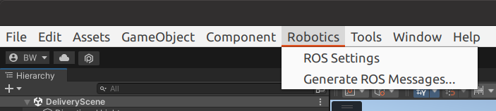
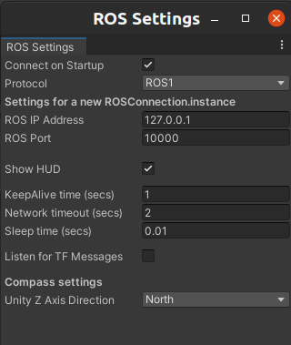

This is how to setup the simulator portion of this project.

# Install

Unity is cross platform. So far, this has only been tested on Ubuntu 20.04.
It may likely work on your machine. If Ubuntu 20.04 is not your operating system,
skip the next section, install Unity however they recommend, and jump to Project Setup

## Ubuntu Unity Installation

Install Unity Hub

```bash
sudo dpkg -i libssl1.0.0_1.0.2n-1ubuntu5.10_amd64.deb
sudo sh -c 'echo "deb https://hub.unity3d.com/linux/repos/deb stable main" > /etc/apt/sources.list.d/unityhub.list'
wget -qO - https://hub.unity3d.com/linux/keys/public | sudo tee /etc/apt/trusted.gpg.d/unityhub.asc
sudo apt-get update
sudo apt-get install -y unityhub
```

Then use the Unity Hub app to install a license:

1. Select the settings gear icon in the upper left next to your account icon
1. Go to Licenses
1. Select "Add" and choose the free personal license

After installing and activating your license, in the Unity Hub app:

1. Switch to the Installs tab
1. Select "Install Editor"
1. Find version 2021.3.16f1 and install (for now, I'm keeping up with the latest release of Unity. 
    The latest will probably work).


## Project Setup

Once the correct version of the Unity Editor is setup, you'll need to configure the editor.

1. In the Unity Hub app's Projects tab
1. Select "Open" and find the root directory for the Unity project (./unity/BWBots ROS1 Simulator)

The Unity Hub app should automatically select the correct version for this project, 
but if you a message about a version mismatch, 
you can download the editor corresponding to the project
or use the latest and potentially have to deal with errors.

To switch versions:
1. In the Unity Hub app
1. Find the DillSim project in the Projects list
1. In the Editor Version column, select the correct editor version (2021.3.16f1)

If you don't see that version, you must install it locally using the steps above.

## VS code editor setup

To use VS Code as your primary Unity editor, [follow this guide](https://code.visualstudio.com/docs/other/unity).

If you're on Ubuntu, I found [this guide from Microsoft](https://learn.microsoft.com/en-us/dotnet/core/install/linux-ubuntu#2004) helpful
for installing dotnet. I have dotnet 5, but 6 also works.

If Omnisharp fails to start, this could be the reason: https://github.com/OmniSharp/omnisharp-vscode/issues/5504

# Dependencies and Configuration


Follow the [Unity Robotics quick setup guide](https://github.com/Unity-Technologies/Unity-Robotics-Hub/blob/main/tutorials/quick_setup.md)

A new menu option call "Robotics" should appear. Click Robotics > ROS Settings.






# Running the Simulation

https://www.youtube.com/watch?v=yX8yrOAjfKM&t=3m51s

1. Assuming you've setup ROS on your local machine [using this guide](local_setup.md),
run this command in a terminal window: 
    ```bash
    roslaunch bw_bringup simulation.launch
    ```
1. Press "Play" in the Unity editor.
1. The simulation is now running! More steps to follow once the project is more ironed out.

## Controls

The default camera mode can be set in `Main Camera > Fpv Camera (Script) > Starting Mode`.

Toggle between modes while the simulation is running by pressing "V" (for view).

The robot is disabled by default. Press the "C" (for Cnabled) key to toggle motors enabled.

### Free cam mode

To move in the X-Z plane, use the WASD keys.
To go up and down (Y axis), use Shift to go down and Space to go up.

Click the game window to lock your cursor. In this state, moving the mouse rotates the camera around.
To exit mouse capture, press the Esc key
or switch to follow robot mode.

Holding Left-Ctrl switches to fast movement mode (speed is configurable).

### Follow robot mode

To drive the robot use the QWEASD keys.

|Key|Action|
|---|---|
| W | drive forward |
| A | rotate left |
| S | drive backward |
| D | rotate right |
| Q | strafe left (at an angle) |
| E | strafe right (at an angle) |
